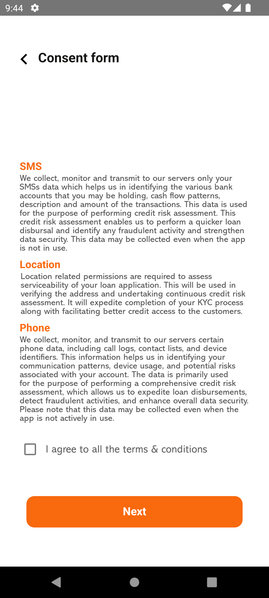

<link rel="stylesheet" href="assets/css/style.css" />

  

    
    <h2>DeviceConnect</h2>
    

      Lets businesses get access to enriched Android mobile device data of customers to build lending and wealth management apps.
    

    

      <a href="sidebarmain.html" class="doc_link">See Documentation →</a>
    

  

